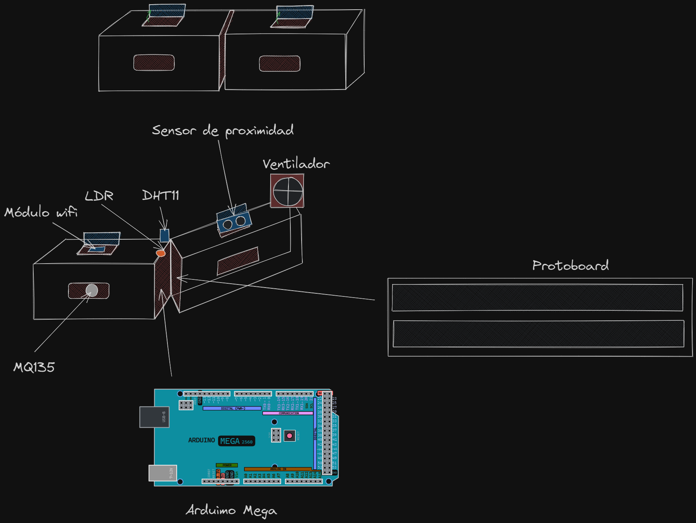
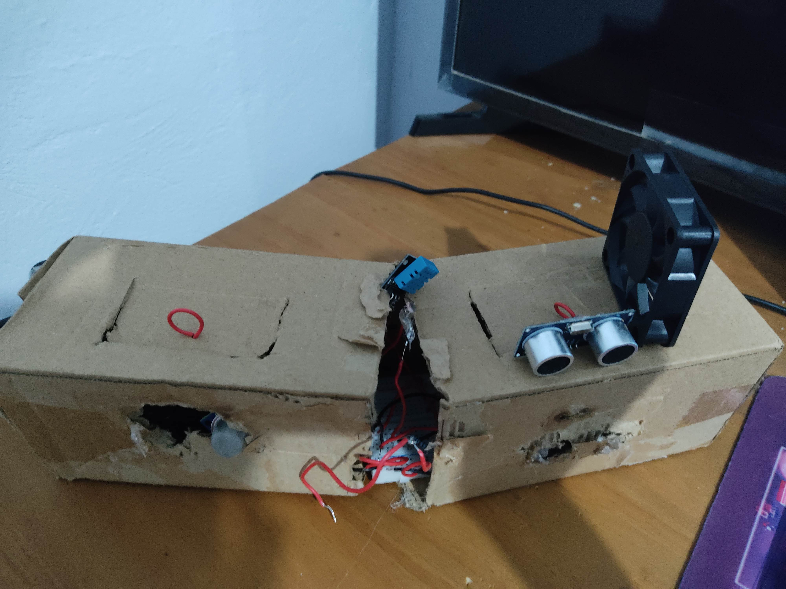
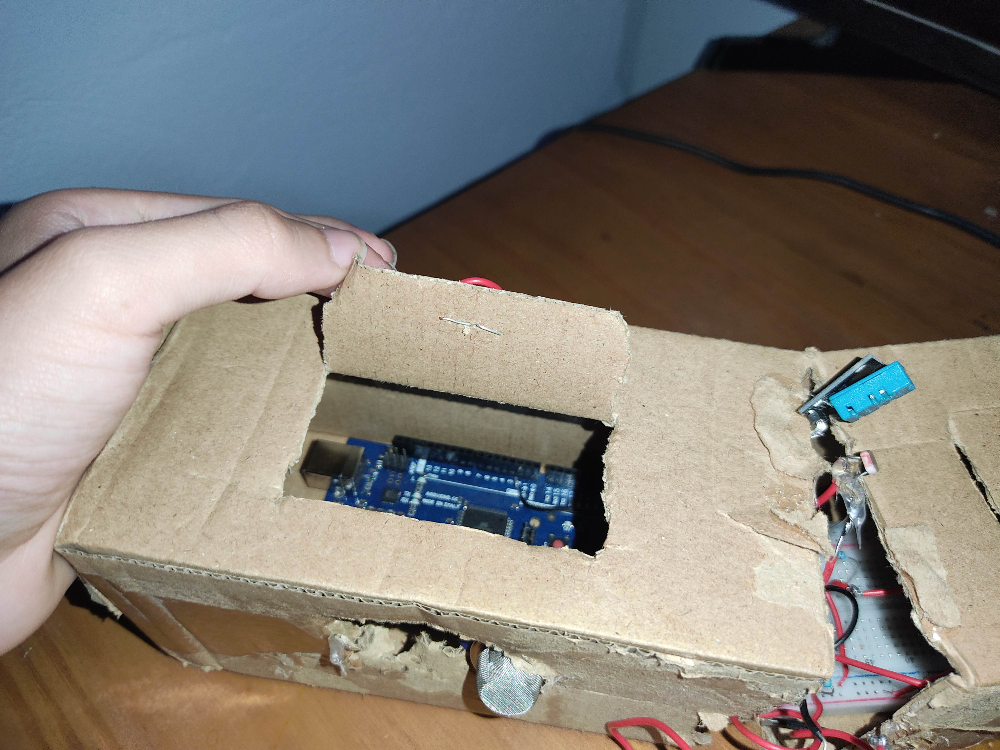
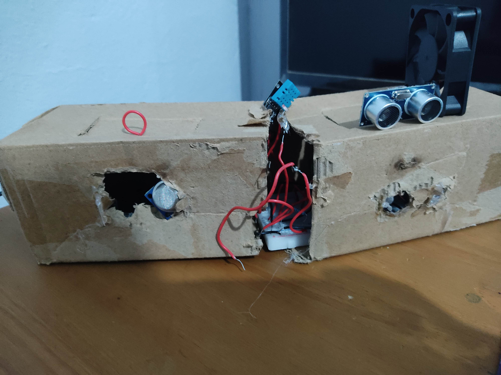

## Control Climático en alcobas Inteligentes a través del Análisis Meteorológico IoT.

## Integrantes

| Nombre                       | Carnet    |
| ---------------------------- | --------- |
| Edgardo Andrés Nil Guzmán    | 201801119 |
| Roberto Carlos Gómez Donis   | 202000544 |
| José Manuel Ibarra Pirir     | 202001800 |
| César André Ramírez Dávila   | 202010816 |
| Angel Francisco Sique Santos | 202012039 |

---

## Índice

- [Uso de sensores](#sensores)
- [Codigo de Arduino](#codigo-de-arduino)
- [Base de Datos](#base-de-datos)
- [Bocetos de prototipos](#bocetos-de-prototipos)
- [Prototipo propuesto](#prototipo-propuesto)
- [Muckup de la aplicación](#muckup-de-la-aplicación)
  - [Sistema de seguridad (puerta)](#sistema-de-seguridad-puerta)
  - [Sistema de ventilación (ventilador)](#sistema-de-ventilación-ventilador)
- [Muckup de la web](#muckup-de-la-web)
  - [Principal](#principal)
  - [Temperatura de la habitación](#temperatura-de-la-habitación)
  - [Presencia humana](#presencia-humana)
  - [Iluminación (activa/inactiva)](#iluminación-activainactiva)
  - [Calidad del aire](#calidad-del-aire)
- [Smart Connected design Framework](#smart-connected-design-framework)
- [Diagramas de flujo](#diagramas-de-flujo)
- [MQTT](#mqtt)

# Sensores
### Sensor de Iluminación
```
// Se le asigna un pin analógico al sensor
#define LDR_PIN A0
// Inicializa la variable
int luz;

  void setup(){

  }

  void loop() {
    // Se lee el valor analógico y se asigna a la variable luz
    luz = analogRead(LDR_PIN);
  }
```
### Presencia Humana
```
#define trigPin 9 // Pin del sensor TRIG
#define echoPin 10 // Pin del sensor ECHO

void setup(){
  pinMode(trigPin, OUTPUT); // Configura el pin TRIG como salida
  pinmode(echoPin, INPUT); // Configura el pin ECHO como entrada
}

void loop(){
  digitalWrite(trigPin, LOW); // Envía un pulso bajo al pin TRIG
  delayMicroseconds(2);
  digitalWrite(trigPin, HIGH); // Envía un pulso alto al pin TRIG
  delayMicroseconds(10);
  digitalWrite(trigPin, LOW); // Apaga el pulso

  long duration = pulseIn(echoPin, HIGH); // Lee la duración del pulso en el pin ECHO
  int distance = duration / 58.2; // Calcula la distancia en centímetros (debe ajustarse según tu sensor)

  if (distance < 100) {
    Serial.print("Persona detectada a una distancia de: ");
    Serial.print(distance);
    Serial.println(" cm");
  } else {
    Serial.println("No se detecta ninguna persona.");
  }

  delay(1000); // Espera 1 segundo antes de volver a medir
}
```
### Sensor de Temperatura
```
#include <DHT.h>

#define DHTPIN 2      // El número del pin digital al que está conectado el sensor DHT11
#define DHTTYPE DHT11  // Tipo del sensor (DHT11 o DHT22)
int temperatura; // Variable que almacena la temperatura

DHT dht(DHTPIN, DHTTYPE); // Inicializa el sensor DHT

void setup() { 
  dht.begin(); // Inicializa el sensor DHT
}

void loop(){
  temperatura = dht.readTemperature(); // Lee la temperatura en grados Celsius
}
```
### Sensor de Calidad de Aire
```
#include <MQ135.h>

#define ANALOG_PIN A0 // Pin analógico al que está conectado el sensor MQ135

MQ135 gasSensor = MQ135(ANALOG_PIN);

void setup() {

}

void loop() {
  float ppmCO2 = gasSensor.getPPM(); // Obtiene la concentración de CO2 en ppm
}
```
### Motor DC (Ventilador)
```
#include <AFMotor.h>

AF_DCMotor motor(1); // Define el motor DC en el puerto 1 del puente H

void setup() {
  motor.setSpeed(255); // Configura la velocidad máxima (0-255)
}

void loop() {
  if(velocidad == 0){
     motor.setSpeed(128); // Velocidad media (0-255)
  motor.run(FORWARD); // Gira el motor en una dirección (sentido de las agujas del reloj)
  }else if (velocidad == 1){
    motor.setSpeed(255); // Velocidad máxima (0-255)
  motor.run(FORWARD); // Gira el motor en la misma dirección
  }else{
      motor.run(RELEASE); // Detiene el motor
  }
}
```
### Servo / Stepper
```
#include <Servo.h>

Servo miServo;  // Crear un objeto Servo

int anguloInicial = 90;  // Ángulo inicial del servo (90 grados)
int paso = 10;           // Tamaño del paso para mover el servo

void setup() {
  miServo.attach(9);  // Asignar el servo al pin 9
}

void loop() {
  // Mover el servo hacia la derecha
  for (int angulo = anguloInicial; angulo <= 180; angulo += paso) {
    miServo.write(angulo);
    delay(500);  // Puedes ajustar el tiempo de espera según tu preferencia
  }
  
  delay(1000);  // Esperar un segundo
  
  // Mover el servo hacia la izquierda
  for (int angulo = anguloInicial; angulo >= 0; angulo -= paso) {
    miServo.write(angulo);
    delay(500);
  }
  
  delay(1000);
}
```
# Codigo de Arduino
Codigo de Arduino para el control de los sensores y actuadores. (En desarrollo)
```
#include <Servo.h>
#include <DHT.h>

// Definición de los pines
#define DHTPIN 2      // Pin digital para el sensor DHT11
#define DHTTYPE DHT11  // Tipo de sensor DHT (DHT11 o DHT22)
#define ANALOG_PIN A0  // Pin analógico para el sensor analógico
#define LDR_PIN A1    // Pin analógico para el sensor LDR
#define FAN_PIN 3     // Pin para el ventilador
#define SERVO_PIN 9   // Pin para el servomotor
#define LED_PIN 13    // Pin para el LED
#define TRIG_PIN 10   // Pin para el pin TRIG del sensor ultrasónico
#define ECHO_PIN 11   // Pin para el pin ECHO del sensor ultrasónico

// Inicialización de objetos
DHT dht(DHTPIN, DHTTYPE); // Objeto para el sensor DHT
Servo myServo; // Objeto para el servomotor

// Variables
int inPin = 3; // Pin para el botón
int btn = 0; // Variable para almacenar el estado del botón
unsigned long time_now = 0;
int period = 1000; // Período de muestreo en milisegundos (1 segundo)

void setup()
{
    Serial.begin(9600);
    dht.begin();
    pinMode(FAN_PIN, OUTPUT);   // Configurar el pin del ventilador como salida
    pinMode(SERVO_PIN, OUTPUT); // Configurar el pin del servomotor como salida
    pinMode(LED_PIN, OUTPUT);   // Configurar el pin del LED como salida
    pinMode(inPin, INPUT);
    pinMode(TRIG_PIN, OUTPUT);  // Configurar el pin TRIG como salida
    pinMode(ECHO_PIN, INPUT);   // Configurar el pin ECHO como entrada

    myServo.attach(SERVO_PIN); // Adjuntar el servo al pin SERVO_PIN
    time_now = millis();
}

void loop()
{
    btn = digitalRead(inPin);

    // Controla el estado del ventilador
    if (btn == 2) {
        digitalWrite(FAN_PIN, HIGH); // Enciende el ventilador
    } else if (btn == 3) {
        digitalWrite(FAN_PIN, LOW); // Apaga el ventilador
    }

    // Controla el estado del LED
    if (btn == 1) {
        digitalWrite(LED_PIN, HIGH); // Enciende el LED
    } else if (btn == 0) {
        digitalWrite(LED_PIN, LOW); // Apaga el LED
    }

    // Realiza la lectura de sensores cada 1000 milisegundos (1 segundo)
    if (millis() >= time_now + period)
    {
        time_now += period;
        float tempC = dht.readTemperature(); // Lee la temperatura
        float humidity = dht.readHumidity(); // Lee la humedad
        int ldrValue = analogRead(LDR_PIN);  // Lee el valor del sensor LDR
        int analogValue = analogRead(ANALOG_PIN); // Lee el valor del sensor analógico

        // Controla el servo basado en la distancia medida por el sensor ultrasónico
        digitalWrite(TRIG_PIN, LOW);
        delayMicroseconds(2);
        digitalWrite(TRIG_PIN, HIGH);
        delayMicroseconds(10);
        digitalWrite(TRIG_PIN, LOW);
        long duration = pulseIn(ECHO_PIN, HIGH);
        float distance_cm = duration * 0.034 / 2;

        // Controla el servo basado en la distancia
        if (distance_cm < 10) {
            myServo.write(90); // Gira el servo a 90 grados
        } else {
            myServo.write(0); // Gira el servo a 0 grados
        }

        // Imprime los valores
        Serial.print("Temp: ");
        Serial.print(tempC);
        Serial.print("°C, Humidity: ");
        Serial.print(humidity);
        Serial.print("%, LDR: ");
        Serial.print(ldrValue);
        Serial.print(", Analog: ");
        Serial.print(analogValue);
        Serial.print(", Distance: ");
        Serial.print(distance_cm);
        Serial.println(" cm");
    }
}
```
La parte del codigo que evita que el flujo entre en estado de absorción es este, donde se utiliza millis(), para que el flujo no se detenga y se pueda seguir ejecutando el codigo.
```
milisegundos (1 segundo)
    if (millis() >= time_now + period)
    {
        time_now += period;
        float tempC = dht.readTemperature(); // Lee la temperatura
        float humidity = dht.readHumidity(); // Lee la humedad
        int ldrValue = analogRead(LDR_PIN);  // Lee el valor del sensor LDR
        int analogValue = analogRead(ANALOG_PIN); // Lee el valor del sensor analógico

        // Controla el servo basado en la distancia medida por el sensor ultrasónico
        digitalWrite(TRIG_PIN, LOW);
        delayMicroseconds(2);
        digitalWrite(TRIG_PIN, HIGH);
        delayMicroseconds(10);
        digitalWrite(TRIG_PIN, LOW);
        long duration = pulseIn(ECHO_PIN, HIGH);
        float distance_cm = duration * 0.034 / 2;

        // Controla el servo basado en la distancia
        if (distance_cm < 10) {
            myServo.write(90); // Gira el servo a 90 grados
        } else {
            myServo.write(0); // Gira el servo a 0 grados
        }

        // Imprime los valores
        Serial.print("Temp: ");
        Serial.print(tempC);
        Serial.print("°C, Humidity: ");
        Serial.print(humidity);
        Serial.print("%, LDR: ");
        Serial.print(ldrValue);
        Serial.print(", Analog: ");
        Serial.print(analogValue);
        Serial.print(", Distance: ");
        Serial.print(distance_cm);
        Serial.println(" cm");
    }
```
# Base de Datos
Las razones principales por las que utilizamos una base de datos en sql son las siguientes:
- SQL es un lenguaje de programación específico diseñado para gestionar bases de datos relacionales. Su sintaxis es relativamente sencilla y se utiliza para realizar operaciones como insertar, actualizar, recuperar y eliminar datos de manera fácil de entender.
- SQL permite realizar consultas complejas para recuperar datos específicos de manera eficiente. Las consultas se pueden personalizar para adaptarse a tus necesidades exactas utilizando cláusulas como SELECT, WHERE, JOIN, GROUP BY, y ORDER BY.
- SQL es escalable, lo que significa que puedes gestionar grandes volúmenes de datos de manera efectiva y optimizar el rendimiento utilizando índices y otras técnicas.

Código de implementación:
```
CREATE TABLE IF NOT EXISTS mediciones(
  id INTEGER PRIMARY KEY AUTOINCREMENT,
  temperatura DECIMAL(5,2) NOT NULL,
  luz INTEGER NOT NULL,
  calidad_aire INTEGER NOT NULL,
  fecha TIMESTAMP DEFAULT CURRENT_TIMESTAMP
);
```
# Bocetos de prototipos

<p align="center">
  
</p>

# Prototipo propuesto

### Vista del prototipo desde arriba.

<p align="center">
  
</p>

### Vista del prototipo hacia adentro.

<p align="center">
  
</p>

### Vista del prototipo de frente.

<p align="center">
  
</p>

# Muckup de la aplicación

A continuación, se presentan dos mockups que representan diferentes aspectos de la aplicación:

## Sistema de seguridad (puerta)

En este mockup, se muestra el diseño de la interfaz de usuario relacionada con el sistema de seguridad de la aplicación. La imagen a continuación ilustra cómo se visualizará la información y las opciones relacionadas con la seguridad de la puerta:

<p align="center">
  
</p>

## Sistema de ventilación (ventilador)

Este mockup representa la sección de control del sistema de ventilación en la aplicación. A través de esta interfaz, los usuarios podrán ajustar la configuración del ventilador para lograr el ambiente deseado. La siguiente imagen muestra cómo se verá esta parte de la aplicación:

<p align="center">
  
</p>

Estos mockups son una representación visual de las funcionalidades de la aplicación relacionadas con la seguridad de la puerta y el sistema de ventilación.

# Muckup de la web

A continuación, se presentan varios mockups que representan diferentes aspectos de la aplicación web:

## Principal

En este mockup principal, se muestra la página de inicio de la aplicación web. Proporciona una visión general de todos los aspectos clave, permitiendo a los usuarios navegar fácilmente hacia las secciones específicas de interés. La siguiente imagen muestra cómo se verá la página principal:

<p align="center">
  
</p>

## Temperatura de la habitación

Este mockup representa la sección de control de la temperatura de la habitación en la aplicación web. Los usuarios podrán ajustar la temperatura de acuerdo con sus preferencias. La siguiente imagen ilustra esta parte de la aplicación:

<p align="center">
  
</p>

## Presencia humana

La aplicación web también ofrece la capacidad de detectar y mostrar la presencia humana en la habitación. El siguiente mockup muestra cómo se visualizará esta información:

<p align="center">
  
</p>

## Iluminación (activa/inactiva)

Otra característica importante es el control de la iluminación en la habitación. Este mockup representa la interfaz para activar o desactivar la iluminación según sea necesario:

<p align="center">
  
</p>

## Calidad del aire

La calidad del aire es crucial para la comodidad y la salud. La aplicación web permite a los usuarios supervisar y mejorar la calidad del aire. A continuación, se muestra cómo se presentará esta información:

<p align="center">
  
</p>

Estos mockups representan visualmente las diversas funcionalidades de la aplicación web relacionadas con la página principal, la temperatura de la habitación, la presencia humana, la iluminación y la calidad del aire.

# Smart Connected design Framework

#### 1. Things

<li> Estos sensores son la parte física que forma la capa Things. Sensores de iluminación, calidad del aire y temperatura dentro de la habitación, estos capturan datos ambientales importantes en la habitación.</li>

#### 2. Hardware

##### MQ135 (Sensor de Calidad del Aire):

<li> Este sensor es un componente físico que recopila datos sobre la calidad del aire en la habitación, detectando sustancias como CO2 y otros gases nocivos.</li>

##### DHT11 (Sensor de Temperatura):

<li>Recopila datos sobre la temperatura en la habitación.</li>

##### LDR (Fotorresistor):

<li> Este componente detecta la cantidad de luz en el entorno y puede utilizarse para medir la intensidad de la iluminación en la habitación.</li>

##### Módulo Wi-Fi ESP8266-01:

<li>Requiere un firmware o programa específico para establecer la conexión Wi-Fi, comunicarse con la nube y procesar los datos.</li>

##### Ventilador 6015 de 12V, 60mm:

<li>Actúa como un método para controlar la temperatura y la ventilación en la habitación.</li>

##### Actuador:

<li>Es un dispositivo o componente que se utiliza para convertir una señal de control en un movimiento físico o acción mecánica.</li>

#### 3. Software

<p>Son dispositivos que necesitan ser controlados para recopilar y transmitir datos. Para lograr esto, se carga un firmware en cada uno de estos sensores. El firmware es un conjunto de instrucciones de bajo nivel que permite a los sensores interactuar con su entorno y comunicar los datos capturados.</p>

##### MQ135 (Sensor de Calidad del Aire):

<li> El firmware para el MQ135 podría involucrar la calibración del sensor y la conversión de las lecturas de resistencia a valores de calidad del aire.</li>

##### DHT11 (Sensor de Temperatura):

<li>Este firmware está programado en el microcontrolador del DHT11 y controla cómo el sensor interactúa con el entorno y genera las lecturas de temperatura.</li>

##### LDR (Fotorresistor):

<li> El firmware o el software correspondiente se encargará de leer la resistencia del LDR, lo que proporciona información sobre la intensidad de la luz ambiental.</li>

##### Módulo Wi-Fi ESP8266-01:

<li>Requiere un firmware personalizado que configure su conexión Wi-Fi, permita la comunicación con otros dispositivos y maneje la transmisión de datos.</li>

##### Ventilador 6015 de 12V, 60mm:

<li>Se necesita un software que permita a los usuarios ajustar la velocidad o encender y apagar el ventilador según las condiciones ambientales.</li>

##### Actuador:

<li>Se necesita programar y controlar los actuadores utilizando el Arduino Integrated Development Environment (IDE). </li>

#### 4. Comunication

<li>La comunicación se realiza mediante una conexión inalámbrica utilizando un componente Wi-Fi. Este componente Wi-Fi permite que la estación envíe datos en tiempo real a través del protocolo MQTT a un servidor MQTT centralizado. El servidor MQTT actúa como intermediario y facilita la comunicación bidireccional entre la estación y la plataforma en la nube. Los datos recopilados por la estación, que incluyen información sobre temperatura, luz, concentración de CO2 y proximidad, se transmiten de manera eficiente a través de MQTT, lo que garantiza una comunicación efectiva y confiable.</li>

#### 5. Cloud Platform

<li>AWS de un servidor MQTT que administra la comunicación de mensajes MQTT entre la estación y la nube. Además, cuenta con una base de datos, Google Cloud Database, donde se almacenan de manera persistente los datos climáticos recopilados, lo que permite su acceso y análisis en cualquier momento. También se incluye un sistema de procesamiento de datos que se encarga de analizar y presentar los datos de manera significativa, lo que facilita el monitoreo en tiempo real y el seguimiento de tendencias a lo largo del tiempo.</li>

#### 6. Cloud Applications

<li>App Inventor, esta plataforma de desarrollo nos permite crear una aplicación móvil que los usuarios pueden utilizar para interactuar con los datos recopilados por los sensores en tiempo real. Se puede diseñar la interfaz de usuario de la aplicación, permitir a los usuarios visualizar los datos de temperatura, humedad, calidad del aire y luz, y también ofrecerles la capacidad de controlar la iluminación y la ventilación en la habitación.</li><br>

<li> En la aplicación web, se intenta aprovechar la versatilidad de la biblioteca P5.js para crear gráficos en tiempo real que reflejan las variaciones de temperatura, niveles de luz, concentración de CO2 y presencia humana en la habitación de forma dinámica. Estos gráficos no solo proporcionan información detallada, sino que también brindan una experiencia visual interactiva para comprender mejor las condiciones ambientales.</li>

# Diagramas de flujo

Sistema de Monitoreo Ambiental Integrado. Este prototipo de Sistema de Monitoreo Ambiental Integrado combina la tecnología de Arduino con una aplicación móvil y una página web para proporcionar a los usuarios una forma efectiva de monitorear y controlar su entorno ambiental. Este sistema tiene un gran potencial en una variedad de aplicaciones y puede mejorar la calidad de vida y la eficiencia en diferentes entornos.

### Prototipo

<p align="center">
  
</p>

### Diagrama

<p align="center">
  
</p>

# MQTT

### ¿Qué es?

MQTT es un protocolo de mensajería basado en estándares, o un conjunto de reglas, que se utiliza para la comunicación de un equipo a otro. Los sensores inteligentes, los dispositivos portátiles y otros dispositivos de Internet de las cosas (IoT) generalmente tienen que transmitir y recibir datos a través de una red con recursos restringidos y un ancho de banda limitado. Estos dispositivos IoT utilizan MQTT para la transmisión de datos, ya que resulta fácil de implementar y puede comunicar datos IoT de manera eficiente. MQTT admite la mensajería entre dispositivos a la nube y la nube al dispositivo.

El protocolo MQTT funciona según los principios del modelo de publicación o suscripción. En la comunicación de red tradicional, los clientes y servidores se comunican directamente entre sí. Los clientes solicitan recursos o datos del servidor, a continuación el servidor procesa y envía una respuesta. Sin embargo, MQTT utiliza un patrón de publicación o suscripción para desacoplar el remitente del mensaje (_publisher_) del receptor del mensaje (_subscriber_). En lugar de ello, un tercer componente, denominado _broker_, controla la comunicación entre editores y suscriptores. El trabajo del _broker_ consiste en filtrar todos los mensajes entrantes de los editores y distribuirlos correctamente a los suscriptores.

### Broker

El _broker_ es un servidor que proporciona un punto de encuentro para los dispositivos y aplicaciones que desean comunicarse entre sí. Es responsable de recibir los mensajes publicados por los _publishers_ y distribuirlos a los _subscribers_ que se han suscrito a los temas correspondientes.

### Tipos de Broker

- **Broker gratuitos:** Estos _brokers_ son ofrecidos por empresas o organizaciones sin ánimo de lucro. Son una buena opción para aplicaciones de prueba o desarrollo. Algunos ejemplos de _brokers_ gratuitos son Mosquitto, HiveMQ y Eclipse Paho.
- **Broker de pago:** Estos _brokers_ ofrecen una serie de funciones y características adicionales, como seguridad, escalabilidad y soporte técnico. Algunos ejemplos de _brokers_ de pago son AWS IoT Core, IBM Watson IoT Platform y Azure IoT Hub.

### Publisher

Un _publisher_ es un dispositivo o aplicación que publica mensajes en un tema. Los mensajes publicados pueden ser de cualquier tipo, como datos sensor, eventos o comandos.

### Subscriber

Un _subscriber_ es un dispositivo o aplicación que se suscribe a un tema para recibir los mensajes que se publican en él. Los _subscribers_ pueden recibir mensajes de cualquier _publisher_ que publique en el tema.

### Topic

Al filtro que el *MQTT* utiliza para la recepción de mensajes se llama *Topic*, este consiste en una cadena de texto UTF-8, y una longitud máxima de 65536 caracteres (aunque lo normal es que sea mucho menor). Se distingue entre mayúsculas y minúsculas.

